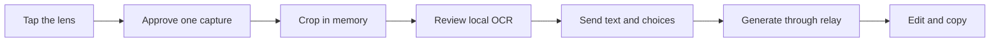

<p align="center">
  
</p>

<p align="center">
  
</p>

<h1 align="center">LM-Comment</h1>

<p align="center">
  Turn the words on your screen into a reply you can edit, copy, and send yourself.
</p>

<p align="center">
  
  
  
  
  <a href="LICENSE"></a>
</p>

LM-Comment is an Android writing tool. Tap its floating lens over any app, approve one screen capture, crop the useful part, review local OCR, and generate up to three editable responses. Nothing is posted for you.

## How it works



- The captured frame stays in memory and is never written to storage or uploaded.
- Bundled ML Kit OCR works without a network connection.
- The screenshot is never sent. The relay receives reviewed text, the selected tone and option count, and any instruction you add.
- The Groq key stays on the relay host and never enters the app or APK.
- There are no accounts, databases, accessibility services, draft history, or automatic posting.

## Product flow

1. Start the compact floating lens.
2. Open the content you want to answer.
3. Tap the lens and approve Android's capture prompt.
4. Crop the relevant area or use the full frame.
5. Check the extracted text and make any edits.
6. Pick a tone, add an optional instruction, and generate one to three options.
7. Edit a result, copy it, and paste it where you choose.

Three synthetic examples are built into the app, so the full workflow can be shown without opening personal content.

## Architecture

| Part | Responsibility |
|---|---|
| `apps/mobile` | Expo 57 product shell, setup, demo, diagnostics, and settings |
| `modules/lm-comment-android` | Floating lens, one-shot MediaProjection, crop, bundled OCR, results, and clipboard flow |
| `apps/relay` | Fastify service with validation, rate limits, stable errors, and the server-side Groq call |
| `contracts` | Shared request, response, and fixture contracts |

The Android workflow uses a normal native activity. Only the 60 dp lens is an overlay. Capture and lens services are separate foreground services with the Android service types required for their jobs.

## Try the signed Android build

[Download LM-Comment 0.1.0 for ARM64 Android](https://github.com/GrimNej/LM-Comment/releases/download/impactforge-2026/LM-Comment-0.1.0-hackathon-arm64.apk).

- Android 8.0 or newer
- ARM64 phone or tablet
- Package: `com.grimnej.lmcomment`
- SHA-256: `E5A2EF822561230CBFEEB80E1A9E252CBC0104B4FB6B296614BBC158A1E16970`

The release uses a dedicated hackathon signing certificate. Android may ask you to allow installation from the browser or file manager used to open the APK.

## Requirements

- Node.js 22.13.1
- pnpm 10.34.5
- Android Studio JBR 21
- Android SDK 36
- Android NDK 27.1.12297006
- Docker, only when building the relay image

On Windows, point `JAVA_HOME` to Android Studio's `jbr` directory. Check the workstation without changing it:

```bash
pnpm doctor
```

## Install and verify

```bash
pnpm install --frozen-lockfile
pnpm quality
pnpm mobile:prebuild
```

Build an ARM64 release for a physical phone:

```powershell
$env:LM_COMMENT_ANDROID_ARCH='arm64-v8a'
pnpm mobile:android:release
```

Generated Android projects and APKs live under `apps/mobile/android/` and are ignored by Git. The current Android release and its local evidence live under `artifacts/`.

Run the native test suite from the generated Android project:

```powershell
cd apps/mobile/android
$env:JAVA_HOME='C:\Program Files\Android\Android Studio\jbr'
.\gradlew.bat :lm-comment-android:testDebugUnitTest
```

## Run the relay

Copy `.env.example` to `.env`, then set a short-lived demo token and the server-side Groq key.

```bash
pnpm relay:dev
```

The mobile app calls only the managed relay. The relay owns model selection, request limits, timeouts, structured output validation, and sanitized logging.

## Demo and evidence

- [Demo runbook](docs/DEMO_RUNBOOK.md)
- [Test evidence](docs/TEST_EVIDENCE.md)
- [Current checkpoint](progress.md)
- [Post-hackathon roadmap](docs/POST_HACKATHON_ROADMAP.md)

The release contract is defined in [`hackathon-release-contract.yaml`](hackathon-release-contract.yaml). The implementation blueprint is recorded in [`LM_COMMENT_FINAL_HACKATHON_IMPLEMENTATION_BLUEPRINT.md`](LM_COMMENT_FINAL_HACKATHON_IMPLEMENTATION_BLUEPRINT.md).

## License

LM-Comment is available under the [MIT License](LICENSE).
