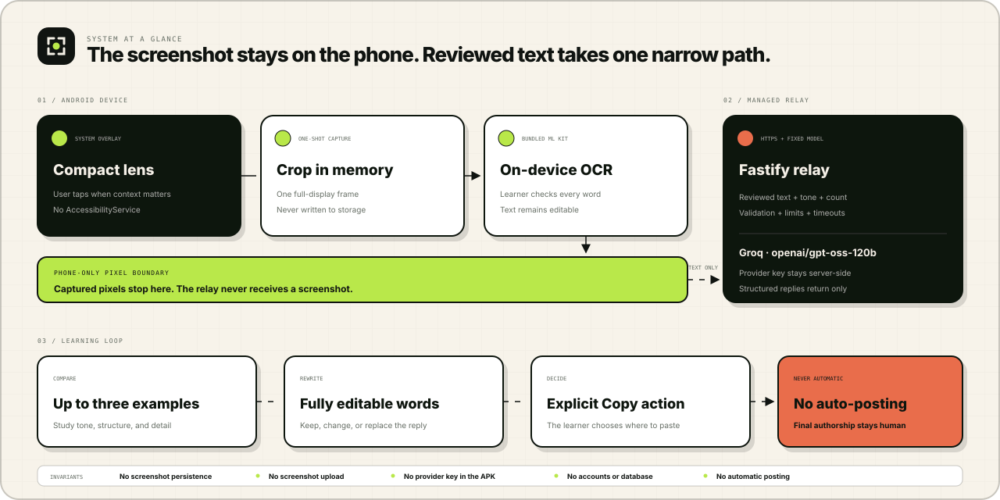

<p align="center">
  
</p>

<p align="center">
  
</p>

<h1 align="center">LM-Comment</h1>

<p align="center">
  <strong>Learn how to join the conversation.</strong><br />
  LM-Comment turns a real post into a short writing exercise: see reply examples, compare them, rewrite one in your voice, and decide what to share.
</p>

<p align="center">
  
  
  
  
  
  <a href="LICENSE"></a>
</p>

<p align="center">
  <a href="https://github.com/GrimNej/LM-Comment/releases/tag/prometheus-july-2026"><strong>Download the signed Android app</strong></a> ·
  <a href="#the-learning-loop"><strong>The learning loop</strong></a> ·
  <a href="#how-it-works">How it works</a> ·
  <a href="#privacy-by-design">Privacy</a> ·
  <a href="#architecture">Architecture</a> ·
  <a href="docs/PROMETHEUS_SUBMISSION.md">Submission brief</a>
</p>

---

## Why LM-Comment exists

Finding a post worth responding to is easy. Finding the right words is not.

Many people open a comment box, hesitate, and keep scrolling. That small moment can mean losing a
chance to practise communication, share a perspective, or become part of a new community.
LM-Comment treats commenting as a skill that can be learned.

It does not post on the learner's behalf. It creates a worked-example loop around a real
communication moment:

| A common writing assistant | LM-Comment |
| --- | --- |
| Starts with an empty prompt | Starts with context the learner chose |
| Returns one answer to accept | Offers up to three examples to compare |
| Encourages passive copying | Keeps every reply fully editable |
| Optimizes for posting quickly | Makes room to observe, rewrite, and practise |
| May act for the user | Ends with an explicit Copy action |

## The learning loop

<p align="center">
  
</p>

1. **Find:** Open a post you genuinely want to respond to.
2. **Select:** Tap the floating lens and crop only the useful context.
3. **Check:** Review the text found by on-device OCR and correct anything that needs attention.
4. **Compare:** Choose a tone and study up to three different reply examples.
5. **Rewrite:** Edit an example, replace it completely, or use its structure to write your own.
6. **Apply:** Copy the final words and decide where, when, or whether to post them.

The generated replies are examples, not measured learning outcomes. The learner remains responsible
for the final message.

## How it works

LM-Comment is a native Android workflow launched from a compact system bubble:

1. Start the lens from the LM-Comment Home screen.
2. Open any visible post, article, or message that you want to answer.
3. Tap the lens and approve Android's one-time screen-capture prompt.
4. Crop the relevant area. The captured frame remains in memory.
5. Run bundled ML Kit OCR locally and review the extracted text.
6. Choose a tone, optional instruction, and one to three reply examples.
7. Generate through the managed relay, compare the results, and edit one.
8. Tap Copy. LM-Comment never presses Post or Send.

Three fictional examples are built into the app, so the complete workflow can be demonstrated
without opening private content.

## Privacy by design

- The captured frame is never written to storage.
- The captured frame is never uploaded.
- Bundled ML Kit OCR runs on the Android device.
- Only reviewed text, tone, option count, and an optional instruction reach the relay.
- The Groq key remains on the relay host and never enters mobile source, build configuration, logs,
  fixtures, or the APK.
- There are no accounts, databases, saved drafts, accessibility services, or automatic posting.

## Architecture

<p align="center">
  
</p>

| Part | Responsibility |
| --- | --- |
| `apps/mobile` | Expo 57 shell, setup, fictional samples, diagnostics, settings, and light/dark themes |
| `modules/lm-comment-android` | Floating lens, one-shot MediaProjection, crop, bundled OCR, generation workflow, editing, and clipboard |
| `apps/relay` | Fastify boundary with strict validation, limits, deadlines, stable errors, and the server-side Groq call |
| `contracts` | Shared request, response, and fixture contracts |

Only the compact lens is a system overlay. Capture, crop, OCR review, reply comparison, and editing
run in a normal Android activity. The lens and capture use separate foreground services with the
Android service types required for their jobs.

## Try the signed Android build

**[Download LM-Comment 0.1.0 for ARM64 Android](https://github.com/GrimNej/LM-Comment/releases/download/prometheus-july-2026/LM-Comment-0.1.0-hackathon-arm64.apk)**

- Android 8.0 or newer
- ARM64 phone or tablet
- Package: `com.grimnej.lmcomment`
- APK size: 53,081,699 bytes
- SHA-256: `67B40D8CDD3565E510F403B090C428DA78577C59C68D4B96B2D6A4CFC1D3F2C3`
- Signature schemes: APK Signature Scheme v2 and v3

The build uses a dedicated hackathon signing certificate. Android may ask you to allow installation
from the browser or file manager used to open the APK.

## Built for the Prometheus July AI Challenge

LM-Comment is a solo student submission built inside the challenge window. Its educational framing
is simple: learners observe examples, compare alternatives, rewrite actively, and apply the result
themselves. AI is central to producing useful examples, while the editable field and explicit Copy
action keep the exercise active and learner-controlled.

- [Prometheus submission brief](docs/PROMETHEUS_SUBMISSION.md)
- [Demo voiceover and screen cues](demo/prometheus-video-cue-sheet.md)
- [Prometheus submission thumbnail](docs/assets/prometheus-thumbnail.png)
- [Current implementation checkpoint](progress.md)

## Repository map

```text
apps/
  mobile/                         Expo product shell and generated Android host
  relay/                          Managed Fastify generation boundary
contracts/                        Shared TypeScript contracts
modules/
  lm-comment-android/             First-party Kotlin and Jetpack Compose module
demo/                             Fictional fixtures, narration, and rehearsal material
docs/                             Architecture, evidence, runbooks, and submission material
deploy/oracle-vps/                Isolated production relay deployment
scripts/                          Quality, release, and provider-boundary gates
```

## Development

### Prerequisites

- Node.js 22.13.x
- pnpm 10.34.5
- Android Studio JBR 21
- Android SDK 36
- Android NDK 27.1.12297006
- Docker, only when building the relay image

On Windows, point `JAVA_HOME` to Android Studio's `jbr` directory. Inspect the workstation without
changing it:

```bash
pnpm doctor
```

### Install and verify

```bash
pnpm install --frozen-lockfile
pnpm quality
pnpm mobile:prebuild
```

Build an ARM64 release for a physical phone:

```powershell
$env:LM_COMMENT_ANDROID_ARCH='arm64-v8a'
pnpm mobile:android:release
```

Generated Android projects and APKs live under `apps/mobile/android/` and are ignored by Git.

Run the first-party native unit suite from the generated Android project:

```powershell
cd apps/mobile/android
$env:JAVA_HOME='C:\Program Files\Android\Android Studio\jbr'
.\gradlew.bat :lm-comment-android:testDebugUnitTest
```

### Run the relay

Copy `.env.example` to `.env`, then provide a short-lived demo token and the server-side Groq key:

```bash
pnpm relay:dev
```

The app calls only the managed relay. The relay owns model selection, request limits, timeouts,
structured-output validation, and sanitized logging.

## Verification and evidence

- [Automated and runtime test evidence](docs/TEST_EVIDENCE.md)
- [Judge demo runbook](docs/DEMO_RUNBOOK.md)
- [Rehearsal checklist](demo/rehearsal-checklist.md)
- [Release contract](hackathon-release-contract.yaml)
- [Implementation blueprint](LM_COMMENT_FINAL_HACKATHON_IMPLEMENTATION_BLUEPRINT.md)
- [Post-hackathon roadmap](docs/POST_HACKATHON_ROADMAP.md)

The published APK was checked for package identity, ABI, alignment, signatures, required service
separation, `noHistory=false`, forbidden Android surfaces, screenshot-like entries, provider keys,
and direct provider endpoints.

## License

LM-Comment is available under the [MIT License](LICENSE).
